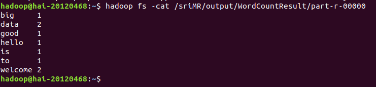
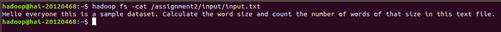
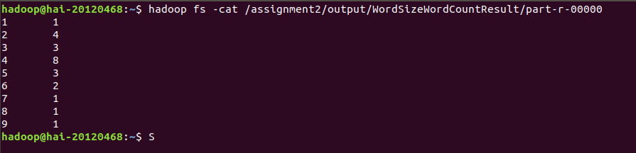
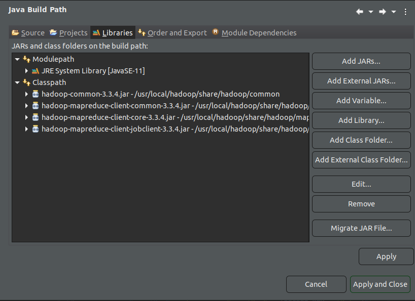
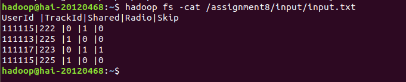
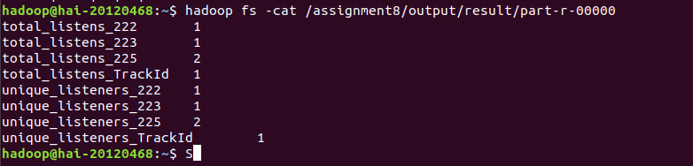
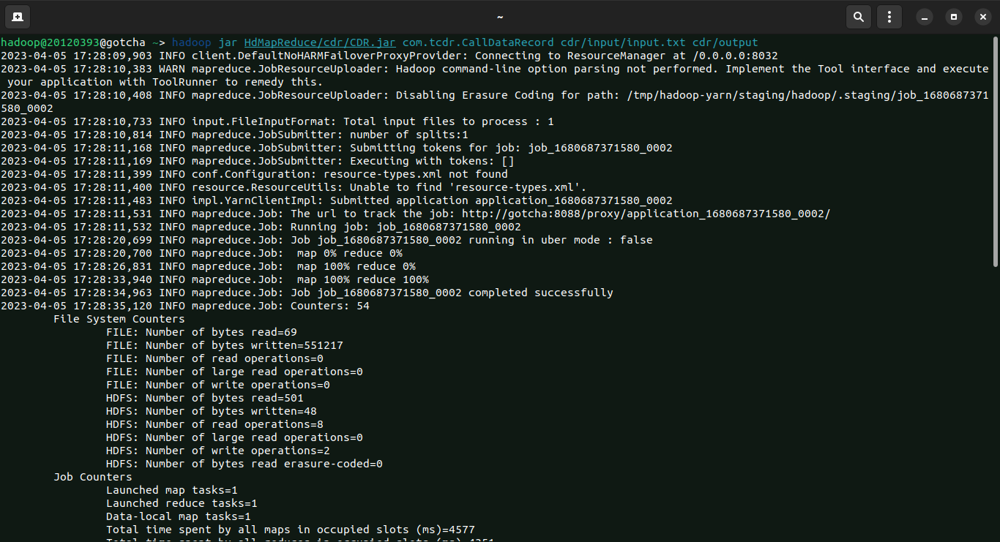
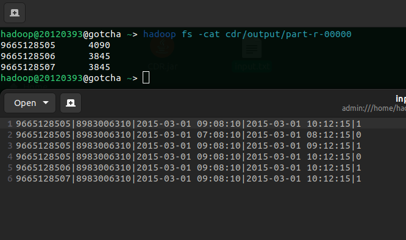
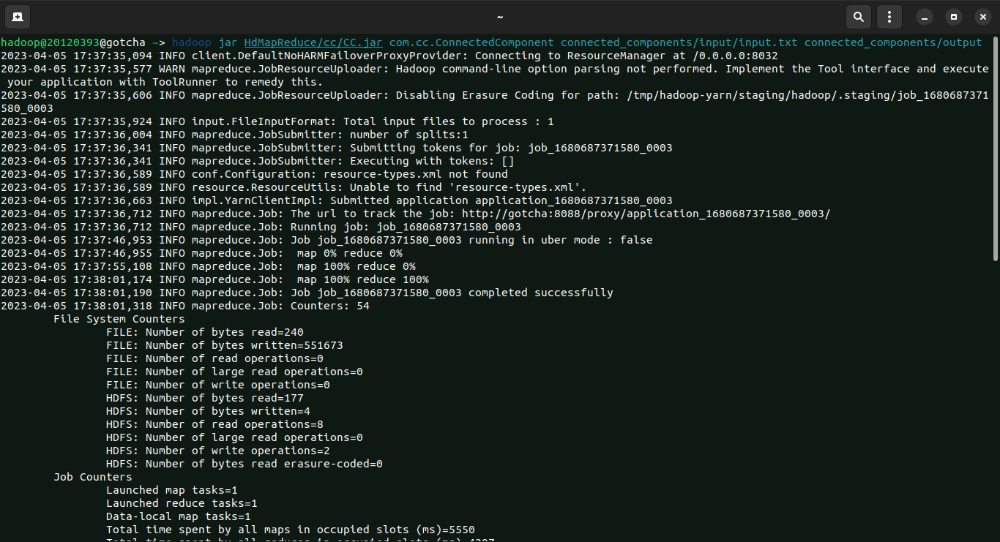
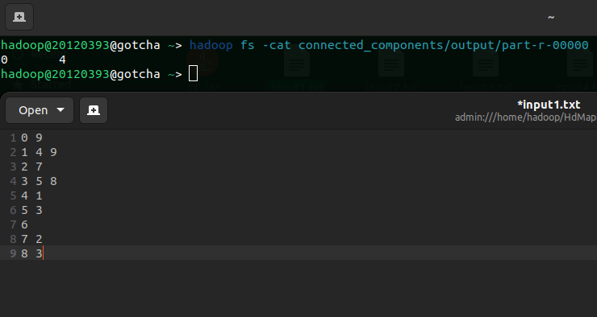

# Lab 01: A Gentle Introduction to Hadoop

## List of team members

| ID       | Full Name          |
| -------- | ------------------ |
| 20120366 | Pham Phu Hoang Son |
| 20120391 | Ha Xuan Truong     |
| 20120393 | Huynh Minh Tu      |
| 20120468 | Nguyen Van Hai     |

## Team's result
| Problem | Complete |
| ------- | -------- |
| 1       | 100%     |
| 2       | 100%     |
| 3       | 100%     |
| 4       | 100%     |
| 5       | 100%     |
| 6       | 100%     |
| 7       | 100%     |
| 8       | 100%     |
| 9       | 100%     |
| 10      | 100%     |

## Team reflection

**Does your journey to the deadline have any bugs? How have you overcome it?**

During the journey towards the deadline, we encountered several bugs that were related to Ubuntu, Hadoop installation, and errors while running Hadoop MapReduce jobs. In order to overcome these challenges, we had to invest more time and effort. We also conducted research by reading documentation and watching tutorial videos. These resources provided us with useful insights and ideas for troubleshooting the issues. Additionally, we scheduled some online meetings to discuss and solve the problems together. Through these efforts, we were able to solve most of the problems we encountered and successfully complete the project.

**What have you learned after this process?**

Firstly, we learned the importance of clear communication among team members to ensure that everyone is on the same page and that tasks are completed efficiently. We also learned the importance of testing and debugging to ensure that any errors are caught and resolved early on in the process.

Secondly, we learned the importance of time management and task prioritization, as we encountered some unexpected challenges during the installation and setup process. This made it necessary for us to adjust our timeline and focus on the most critical tasks first.

Lastly, we learned the importance of continuous learning and self-improvement. We encountered some roadblocks that required us to do additional research and seek out new solutions, which allowed us to expand our knowledge and skills in Hadoop and MapReduce.


## Problems

### Problem 1

#### Solution idea:

Read each line of data and split it into single words, then count the number of occurrences of each word
#### Explain idea:

1. The `Mapper` class: This class extends the Mapper abstract class and overrides the `map()` method. The `map()` method reads each line of the input text file, splits it into individual words, and emits a key-value pair of `(word, 1)`. The key is the individual word, and the value is a constant integer 1. This class also defines the data types of the input key-value pairs and the output key-value pairs.
2. The `Reducer` class: This class extends the Reducer abstract class and overrides the `reduce()` method. The `reduce()` method receives a key-value pair of `(word, list of values)`, where the key is a word and the value is a list of integers (each integer represents a count of the word). The `reduce()` method sums up the values in the list and emits a key-value pair of `(word, sum of counts)`.

#### One example:

1. Input


2. Output


### Problem 2

#### Solution idea:
The solution is to count the number of words of each length in a given text document using the MapReduce programming model.
#### Explain idea:
1. The `Mapper` class, the `map()` method takes in a key-value pair consisting of a byte offset and a line of text, and emits intermediate key-value pairs consisting of the length of each word in the line and the value 1, and the same length with a value of 0. The `IntWritable` class is used to represent the integer keys and values.

2. The `Reducer` class, the `reduce()` method takes in intermediate key-value pairs and sums up the values associated with each key, giving a final count of the number of words of each length. The results are written to output using the `context.write` method.

3. The `WordSizeWordCount` class, the `main()` method sets up and runs the MapReduce job, configuring input and output paths, setting up the mapper and reducer classes, and specifying input and output formats. Finally, the job is executed using `job.waitForCompletion(true)`.
#### One example:

1. Input


2. Output


### Problem 3

### Problem 4

### Problem 5

### Problem 6

The problem statement in the book was unclear, and I had to conduct some internet research to understand the nature of the problem.

#### Solution idea:

Create a function called `stringToEncrypt` to encrypt a given string. 
**Mapper**: Extract fields from input string. For each fields that requires encryption, apply the `stringToEncrypt` function.

#### Explain:

This program is a Java-based implementation of MapReduce that aims to de-identify data by encrypting specific fields. It accepts a CSV input file and encrypts the specified fields using the AES algorithm. The resulting encrypted data is written to an output file, where each field is separated by a comma. The program leverages Hadoop to solve this problem efficiently by processing the input data in parallel, which is particularly useful for encrypting large datasets.

The program defines a static class named `DeIdentifyData` that contains a `Map` class, a `stringToEncrypt` function, and a `main` function.

The Map class extends the Mapper class, which is a component of Hadoop MapReduce that processes the input data in a parallel and distributed manner. The input data is split into lines, and each line is further split into fields based on the CSV format.

The program uses a list of integers `ENCRYPT_COLS` to specify which fields need to be encrypted. The `Map` class checks whether a field is in this list by calling the `encryptColList.contains(i + 1)` method. If the field needs to be encrypted, the program calls the `stringToEncrypt` function, which encrypts the input string using the AES algorithm and a secret key. The encrypted string is then returned to the Map class, where it is appended to a `StringBuilder` object. After all the fields in a line have been processed, the `StringBuilder` object is converted to a `Text` object and written to the output file.

The `stringToEncrypt` function takes a string as input and returns an encrypted string. The function first creates a `SecretKeySpec` object using the `SECRET_KEY` and the AES algorithm. It then creates a `Cipher` object using the same algorithm and initializes it in encryption mode with the secret key. The function then encrypts the input string using the `doFinal` method and encodes the result using Base64 encoding.

#### Running process:

**Step 1: Project Creation**

File -> New -> Java Project -> project name: DeIdentifyData

**Step 2: Package Creation**

Right click project name -> New -> Package -> give package name as "com.deiddata" and then
Click Finish button

**Step 3: Class Creation**

Right click project name -> New -> Class -> give class name as "DeIdentifyData” and then
Click Finish button

**Step 4: Add External Jars**

Right click project name -> Build Path -> Configure Build Path... -> click Libraries pane -> Classpath -> Add External JARs -> file system ->



Click Apply and Close button

**Step 5: Copy the program from src folder**

**Step 6: Export JAR file creation**

Right click project name -> Export -> Java -> JAR file -> click Next button -> Select Export destination -> click Finish

**Step 7: Program execution**

```
# Create new folder name "deiddata" in HDFS
hadoop fs -mkdir -p deiddata

# Create "input" folder in "deiddata" folder to store input file
hadoop fs -mkdir -p deiddata/input

# Put input.txt file from local into "input" directory
hadoop fs -put /<local_file_path>/input.txt deiddata/input

# Run mapreduce program
hadoop jar DeIdData.jar com.deiddata deiddata/input/input.txt deiddata/output
```

### Problem 7

### Problem 8

#### Solution idea:
The program takes a dataset of music listening events and computes various statistics related to the number of times each song was listened to, the number of unique listeners, whether a song was shared, listened to on the radio, and skipped on the radio. The program also handles invalid records in the dataset by counting them and outputting the count at the end.
#### Explain idea:
1. The `Mapper` class: The code defines a Mapper class called `MusicStatsMapper` which extends the Hadoop MapReduce Mapper class. In the mapper, each record is split into its constituent parts and checked for validity, and if it is valid, the mapper emits key-value pairs where the key is a string representing the type of statistic to be calculated and the value is always 1. The keys are formed by concatenating the relevant prefix with the track ID. For example, `unique_listeners_123` indicates that the track with ID 123 has been played by a unique listener.

2. The `Reducer` class: The code also defines a Reducer class called `MusicStatsReducer` which extends the Hadoop MapReduce Reducer class. In the reducer, the values for each key are summed up to calculate the total number of times the track was played or interacted with in the given way.

3. The `Main` method of the code is responsible for setting up the Hadoop job by configuring it with the necessary classes and input/output paths. The job is executed and the counters are retrieved to print out the number of invalid records encountered during processing.
#### One example:

1. Input


2. Output


### Problem 9

#### Solution idea:

**Mapper**: Extract these fields from input string: fromPhoneNumber, callStartTime, callEndTime, and stdFlag. If the value of stdFlag is equal to 1, then calculate the call duration by subtracting the callStartTime from the callEndTime.

**Reducer**: Group the calls by the phone number and calculate the total duration of each phone number to identify which phone number has total duration is greater than or equal to one hour.

#### Explain:

This is a MapReduce program written in Java that processes Call Data Records (CDR) and outputs the total duration of each phone number that has made a call lasting for more than one hour. The input data is assumed to be in a pipe-separated (|) format.

The program has two classes: `CDRMapper`, `CDRReducer` and `main` function. `The CDRMapper` class reads in each line of input data, splits it into fields, and extracts the `fromPhoneNumber`, `callStartTime`, `callEndTime`, and `stdFlag` fields. The `stdFlag` indicates whether the call is a long-distance (1) call or not. If the call is long-distance, the duration of the call is computed by subtracting the `callEndTime` from the `callStartTime`, dividing the result by 1000 to convert it from milliseconds to seconds, and emitting a key-value pair with the phone number as the key and the duration as the value.

The `CDRReducer` class receives the key-value pairs from the mapper, groups them by the phone number, and computes the total duration of each phone number. If the total duration of a phone number is greater than or equal to one hour (3600 seconds), it emits the phone number and the total duration as a key-value pair.

#### Running process:

**Step 1: Project Creation**

File -> New -> Java Project -> project name: TelecomCallDataRecord

**Step 2: Package Creation**

Right click project name -> New -> Package -> give package name as "com.tcdr" and then
Click Finish button

**Step 3: Class Creation**

Right click project name -> New -> Class -> give class name as "CallDataRecord” and then
Click Finish button

**Step 4: Add External Jars**

Right click project name -> Build Path -> Configure Build Path... -> click Libraries pane -> Classpath -> Add External JARs -> file system ->


Click Apply and Close button

**Step 5: Copy the program from src folder**

**Step 6: Export JAR file creation**

Right click project name -> Export -> Java -> JAR file -> click Next button -> Select Export destination -> click Finish

**Step 7: Program execution**

```
# Create new folder name "cdr" in HDFS
hadoop fs -mkdir -p cdr

# Create "input" folder in "cdr" folder to store input file
hadoop fs -mkdir -p cdr/input

# Put input.txt file from local into "input" directory
hadoop fs -put <local_file_path>/input.txt cdr/input

# Run mapreduce program
hadoop jar <local_file_path>/CDR.jar com.tcdr.CallDataRecord cdr/input/input.txt cdr/output

# View output
hadoop fs -cat cdr/output/part-r-00000
```

#### Result:





### Problem 10

#### Solution idea:

**Mapper**: The input string should be converted to a map structure that defines the edges of the graph.

**Reducer**: The map structure should be used to save the key as the node of the graph, and the value should be a list of its neighbors. Then, the cleanup function can use that map structure to perform a DFS algorithm to count the connected components.

#### Explain:

This is a MapReduce program for finding the number of connected components in an undirected graph. The input to the program is a text file containing one line per node, with each line containing a node ID followed by the IDs of its neighbors, separated by whitespace.

The program consists of three classes: `CCMapper`, `CCCombiner`, and `CCReducer`, each of which extends the `Mapper` or `Reducer` class.

`CCMapper` is responsible for reading each line of the input file and emitting key-value pairs that represent the edges in the graph. The mapper extracts the node ID and its neighbor IDs from each line, and emits a pair for each edge in the graph. Specifically, for each node ID, the mapper emits a pair with the node ID as the key and the neighbor IDs as the value. Additionally, for each neighbor ID, the mapper emits a pair with the neighbor ID as the key and the node ID as the value.

`CCCombiner` is a local reducer that receives the output of the mapper and aggregates the values for each key by eliminating duplicates. The output of the combiner is a set of unique edges.

`CCReducer` is responsible for computing the connected components of the graph using depth-first search (DFS). The reducer builds a map of each node and its neighbors, and initializes a visited map to keep track of which nodes have been visited. It then iterates through the nodes and performs DFS starting from each unvisited node. The DFS function updates the visited map to mark the nodes that have been visited. After DFS has been performed on all unvisited nodes, the reducer emits a single pair with a key of 0 and a value of the number of connected components found.

#### Running process:

**Step 1: Project Creation**

File -> New -> Java Project -> project name: ConnectedComponent

**Step 2: Package Creation**

Right click project name -> New -> Package -> give package name as "com.cc" and then
Click Finish button

**Step 3: Class Creation**

Right click project name -> New -> Class -> give class name as "ConnectedComponent” and then
Click Finish button

**Step 4: Add External Jars**

Right click project name -> Build Path -> Configure Build Path... -> click Libraries pane -> Classpath -> Add External JARs -> file system ->


Click Apply and Close button

**Step 5: Copy the program from src folder**

**Step 6: Export JAR file creation**

Right click project name -> Export -> Java -> JAR file -> click Next button -> Select Export destination -> click Finish

**Step 7: Program execution**

```
# Create new folder name "cdr" in HDFS
hadoop fs -mkdir -p connected_components

# Create "input" folder in "cdr" folder to store input file
hadoop fs -mkdir -p connected_components/input

# Put input.txt file from local into "input" directory
hadoop fs -put <local_file_path>/input.txt connected_components/input

# Run mapreduce program
hadoop jar <local_file_path>/CC.jar com.cc.ConnectedComponent connected_components/input/input.txt connected_components/output

# View output
hadoop fs -cat connected_components/output/part-r-00000
```

#### Result:





## References

<!-- References without citing, this will be display as resources -->

- Example: WordCount v1.0: https://hadoop.apache.org/docs/current/hadoop-mapreduce-client/hadoop-mapreduce-client-core/MapReduceTutorial.html#Example:_WordCount_v1.0

- Reducer (Apache Hadoop Main 2.7.5 API): https://hadoop.apache.org/docs/r2.7.5/api/org/apache/hadoop/mapreduce/Reducer.html#cleanup-org.apache.hadoop.mapreduce.Reducer.Context-

<!-- References with citing, this will be display as footnotes -->

<!-- [^fn1]:
    So Chris Krycho, "Not Exactly a Millennium," chriskrycho.com, July 2015, http://v4.chriskrycho.com/2015/not-exactly-a-millennium.html
    (accessed July 25, 2015)

[^fn2]: Contra Krycho, 15, who has everything _quite_ wrong.
[^fn3]: ibid -->
