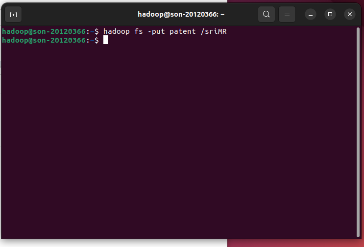
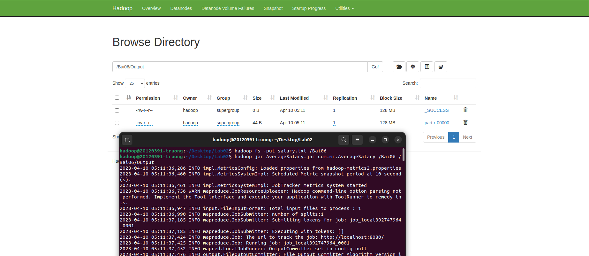

# Lab 01: A Gentle Introduction to Hadoop

## List of team members

| ID       | Full Name          |
| -------- | ------------------ |
| 20120366 | Pham Phu Hoang Son |
| 20120391 | Ha Xuan Truong     |
| 20120393 | Huynh Minh Tu      |
| 20120468 | Nguyen Van Hai     |

## Team's result
| Problem | Complete |
| ------- | -------- |
| 1       | 100%     |
| 2       | 100%     |
| 3       | 100%     |
| 4       | 100%     |
| 5       | 100%     |
| 6       | 100%     |
| 7       | 100%     |
| 8       | 100%     |
| 9       | 100%     |
| 10      | 100%     |

## Team reflection

**Does your journey to the deadline have any bugs? How have you overcome it?**

During our MapReduce Hadoop Java project, we faced a few logical bugs. One example was when we were implementing a custom reducer function that was not producing the expected output. After investigating, we discovered that the issue was with our implementation of the function. Specifically, we had made an error in the logic of our code that resulted in incorrect output.

To overcome this bug, we first used debugging tools to identify the source of the issue. Once we had identified the function as the problem area, we took a closer look at our code and worked to identify the error in our logic. We also discussed the issue as a team and reviewed each other's code to find potential solutions.

Ultimately, we were able to solve the issue by correcting the logical error in our reducer function. We also added additional unit tests to ensure that the function was producing the correct output. Through this process, we learned the importance of careful code review and testing, as well as the importance of understanding the logic of our code in-depth.

**What have you learned after this process?**

We gained a deeper understanding of the MapReduce Hadoop Java platform by working through the bugs and exploring different solutions. This experience helped us improve our knowledge of the platform and be better prepared to tackle similar challenges in the future.

## Problems

We coded some of the problems ourselves, while for other problems, we referred to the solutions.

### Problem 1

#### Solution idea:

Read each line of data and split it into single words, then count the number of occurrences of each word
#### Explain idea:

1. The `Mapper` class: This class extends the Mapper abstract class and overrides the `map()` method. The `map()` method reads each line of the input text file, splits it into individual words, and emits a key-value pair of `(word, 1)`. The key is the individual word, and the value is a constant integer 1. This class also defines the data types of the input key-value pairs and the output key-value pairs.
2. The `Reducer` class: This class extends the Reducer abstract class and overrides the `reduce()` method. The `reduce()` method receives a key-value pair of `(word, list of values)`, where the key is a word and the value is a list of integers (each integer represents a count of the word). The `reduce()` method sums up the values in the list and emits a key-value pair of `(word, sum of counts)`.

#### Running Process:

**Step 1: Create a input folder, output folder and put input file** 

**Step 2: Export file jar** 

**Step 3: Running jar** 

**Step 4: Check result** 

### Problem 2

#### Solution idea:
The solution is to count the number of words of each length in a given text document using the MapReduce programming model.
#### Explain idea:
1. The `Mapper` class, the `map()` method takes in a key-value pair consisting of a byte offset and a line of text, and emits intermediate key-value pairs consisting of the length of each word in the line and the value 1, and the same length with a value of 0. The `IntWritable` class is used to represent the integer keys and values.

2. The `Reducer` class, the `reduce()` method takes in intermediate key-value pairs and sums up the values associated with each key, giving a final count of the number of words of each length. The results are written to output using the `context.write` method.

3. The `WordSizeWordCount` class, the `main()` method sets up and runs the MapReduce job, configuring input and output paths, setting up the mapper and reducer classes, and specifying input and output formats. Finally, the job is executed using `job.waitForCompletion(true)`.
#### Running Process:

**Step 1: Create a input folder, output folder and put input file** 

**Step 2: Export file jar** 

**Step 3: Running jar** 

**Step 4: Check result** 

### Problem 3
#### Solution idea:
Reads the weather data line by line and extracts the date, maximum temperature, and minimum temperature. Then compare them with the given min max temperature.
#### Explain:
`MaxTemperatureMapper` class is responsible for reading the weather data and emitting key-value pairs for hot and cold days. The mapper reads each line of the input file, extracts the date, maximum temperature, and minimum temperature, and checks if the maximum temperature is above a predefined `HOT_THRESHOLD` or if the minimum temperature is below a predefined `COLD_THRESHOLD`. If either of these conditions is true, the mapper emits a key-value pair with the date as the key and the temperature as the value.

`MaxTemperatureReducer` class receives the key-value pairs emitted by the mapper and finds the maximum temperature for each date. The reducer iterates over the values for each key and finds the maximum value. It then emits a key-value pair with the date and maximum temperature.
#### Running process:

**Step 1: Put file weather_data.txt** 

**Step 2: Export Weather.jar**

**Step 3: Run Weather.jar**

#### Result:

### Problem 4
#### Solution idea: 
Extract the patent id and the sub-patent id in Map.Then send it to Reduce for counting.
#### Explain:
In the class `map`, the input line is first converted to a String using the toString() method of the Text class. Then, a StringTokenizer object is created to split the line into tokens using space as the delimiter. The first token represents the patent ID, which is set as the key of the output tuple. The second token represents the sub-patent ID, which is set as the value of the output tuple. Finally, the output tuple (key, value) is written to the context using the write() method.
In the class `reduce`, the number of sub-patents for each patent is counted by iterating through the list of sub-patent IDs and incrementing a counter variable for each sub-patent ID
#### Running process:
**Step 1: Put file patent** 

**Step 2: Export Patent.jar**

**Step 3: Run Patent.jar**

#### Result:

### Problem 5

#### Solution idea:

The `mapper` extracts the year and temperature values and emits them as key-value pairs, where the year is the key and the temperature is the value. The `reducer` receives all key-value pairs within the same year and calculates the maximum temperature for that year.

#### Explain:

The `mapper` reads the input dataset line by line and tokenizes each line using whitespace as the delimiter. It checks whether the first token is a 4-digit number and sets the "year" variable accordingly. If the token is not a year, it assumes it is a temperature and sets the "temperature" variable accordingly. It then emits a (key, value) pair, where the key is the year and the value is the temperature.

The `reducer` receives these (key, value) pairs, where the key is the year and the value is a list of temperatures. It iterates over the list of temperatures and finds the maximum temperature for that year. It then emits a (key, value) pair, where the key is the year and the value is the maximum temperature.

#### Running process:

**Step 1: Put file Temperature.txt into HDFS**

**Step 2: Export MaxTemp.jar**

**Step 3: Run MapReduce program**

#### Result:

### Problem 6

#### Solution idea:

The program consists of a `mapper` class, which reads input data and emits key-value pairs of department IDs and salaries, and a `reducer` class, which receives the key-value pairs from the mapper, calculates the average salary for each department, and outputs the result.

#### Explain:

In the `mapper` class `avgMapper`, each line of input is split into three fields separated by tabs. The first field represents the department id, the second field represents the employee name, and the third field represents the salary. The department id and salary are extracted and stored in `Text` and `FloatWritable` objects, respectively, and emitted as key-value pairs.

In the `reducer` class `avgReduce`r, the input key-value pairs are grouped by department id, and the average salary is calculated for each department. The `reduce()` method iterates over the values and calculates the sum and count of salaries for each department. Finally, the average salary is calculated as the sum divided by the count, and the result is emitted as a key-value pair.

#### Running process:

**Step 1: Put file salary.txt into HDFS**

**Step 2: Export AverageSalary.jar**

**Step 3: Run MapReduce program**

#### Result:

### Problem 7

The problem statement in the book was unclear, and I had to conduct some internet research to understand the nature of the problem.

#### Solution idea:

Create a function called `stringToEncrypt` to encrypt a given string. 
**Mapper**: Extract fields from input string. For each fields that requires encryption, apply the `stringToEncrypt` function.

#### Explain:

This program is a Java-based implementation of MapReduce that aims to de-identify data by encrypting specific fields. It accepts a CSV input file and encrypts the specified fields using the AES algorithm. The resulting encrypted data is written to an output file, where each field is separated by a comma. The program leverages Hadoop to solve this problem efficiently by processing the input data in parallel, which is particularly useful for encrypting large datasets.

The program defines a static class named `DeIdentifyData` that contains a `Map` class, a `stringToEncrypt` function, and a `main` function.

The Map class extends the Mapper class, which is a component of Hadoop MapReduce that processes the input data in a parallel and distributed manner. The input data is split into lines, and each line is further split into fields based on the CSV format.

The program uses a list of integers `ENCRYPT_COLS` to specify which fields need to be encrypted. The `Map` class checks whether a field is in this list by calling the `encryptColList.contains(i + 1)` method. If the field needs to be encrypted, the program calls the `stringToEncrypt` function, which encrypts the input string using the AES algorithm and a secret key. The encrypted string is then returned to the Map class, where it is appended to a `StringBuilder` object. After all the fields in a line have been processed, the `StringBuilder` object is converted to a `Text` object and written to the output file.

The `stringToEncrypt` function takes a string as input and returns an encrypted string. The function first creates a `SecretKeySpec` object using the `SECRET_KEY` and the AES algorithm. It then creates a `Cipher` object using the same algorithm and initializes it in encryption mode with the secret key. The function then encrypts the input string using the `doFinal` method and encodes the result using Base64 encoding.

#### Running process:

**Step 1: Put file input.txt into HDFS**

**Step 2: Export DeIdData.jar**

**Step 3: Run MapReduce program**

#### Result:

### Problem 8

#### Solution idea:
The program takes a dataset of music listening events and computes various statistics related to the number of times each song was listened to, the number of unique listeners, whether a song was shared, listened to on the radio, and skipped on the radio. The program also handles invalid records in the dataset by counting them and outputting the count at the end.
#### Explain idea:
1. The `Mapper` class: The code defines a Mapper class called `MusicStatsMapper` which extends the Hadoop MapReduce Mapper class. In the mapper, each record is split into its constituent parts and checked for validity, and if it is valid, the mapper emits key-value pairs where the key is a string representing the type of statistic to be calculated and the value is always 1. The keys are formed by concatenating the relevant prefix with the track ID. For example, `unique_listeners_123` indicates that the track with ID 123 has been played by a unique listener.

2. The `Reducer` class: The code also defines a Reducer class called `MusicStatsReducer` which extends the Hadoop MapReduce Reducer class. In the reducer, the values for each key are summed up to calculate the total number of times the track was played or interacted with in the given way.

3. The `Main` method of the code is responsible for setting up the Hadoop job by configuring it with the necessary classes and input/output paths. The job is executed and the counters are retrieved to print out the number of invalid records encountered during processing.
#### Running Process:

**Step 1: Create a input folder, output folder and put input file** 

**Step 2: Export file jar** 

**Step 3: Running jar** 

**Step 4: Check result** 

### Problem 9

#### Solution idea:

**Mapper**: Extract these fields from input string: fromPhoneNumber, callStartTime, callEndTime, and stdFlag. If the value of stdFlag is equal to 1, then calculate the call duration by subtracting the callStartTime from the callEndTime.

**Reducer**: Group the calls by the phone number and calculate the total duration of each phone number to identify which phone number has total duration is greater than or equal to one hour.

#### Explain:

This is a MapReduce program written in Java that processes Call Data Records (CDR) and outputs the total duration of each phone number that has made a call lasting for more than one hour. The input data is assumed to be in a pipe-separated (|) format.

The program has two classes: `CDRMapper`, `CDRReducer` and `main` function. `The CDRMapper` class reads in each line of input data, splits it into fields, and extracts the `fromPhoneNumber`, `callStartTime`, `callEndTime`, and `stdFlag` fields. The `stdFlag` indicates whether the call is a long-distance (1) call or not. If the call is long-distance, the duration of the call is computed by subtracting the `callEndTime` from the `callStartTime`, dividing the result by 1000 to convert it from milliseconds to seconds, and emitting a key-value pair with the phone number as the key and the duration as the value.

The `CDRReducer` class receives the key-value pairs from the mapper, groups them by the phone number, and computes the total duration of each phone number. If the total duration of a phone number is greater than or equal to one hour (3600 seconds), it emits the phone number and the total duration as a key-value pair.

#### Running process:

**Step 1: Put file input.txt into HDFS**

**Step 2: Export CDR.jar**

**Step 3: Run MapReduce program**

#### Result:

### Problem 10

#### Solution idea:

**Mapper**: The input string should be converted to a map structure that defines the edges of the graph.

**Reducer**: The map structure should be used to save the key as the node of the graph, and the value should be a list of its neighbors. Then, the cleanup function can use that map structure to perform a DFS algorithm to count the connected components.

#### Explain:

This is a MapReduce program for finding the number of connected components in an undirected graph. The input to the program is a text file containing one line per node, with each line containing a node ID followed by the IDs of its neighbors, separated by whitespace.

The program consists of three classes: `CCMapper`, `CCCombiner`, and `CCReducer`, each of which extends the `Mapper` or `Reducer` class.

`CCMapper` is responsible for reading each line of the input file and emitting key-value pairs that represent the edges in the graph. The mapper extracts the node ID and its neighbor IDs from each line, and emits a pair for each edge in the graph. Specifically, for each node ID, the mapper emits a pair with the node ID as the key and the neighbor IDs as the value. Additionally, for each neighbor ID, the mapper emits a pair with the neighbor ID as the key and the node ID as the value.

`CCCombiner` is a local reducer that receives the output of the mapper and aggregates the values for each key by eliminating duplicates. The output of the combiner is a set of unique edges.

`CCReducer` is responsible for computing the connected components of the graph using depth-first search (DFS). The reducer builds a map of each node and its neighbors, and initializes a visited map to keep track of which nodes have been visited. It then iterates through the nodes and performs DFS starting from each unvisited node. The DFS function updates the visited map to mark the nodes that have been visited. After DFS has been performed on all unvisited nodes, the reducer emits a single pair with a key of 0 and a value of the number of connected components found.

#### Running process:

**Step 1: Put file input.txt into HDFS**

**Step 2: Export CC.jar**

**Step 3: Run MapReduce program**

#### Result:

## References

<!-- References without citing, this will be display as resources -->

- Example: WordCount v1.0: https://hadoop.apache.org/docs/current/hadoop-mapreduce-client/hadoop-mapreduce-client-core/MapReduceTutorial.html#Example:_WordCount_v1.0

- Reducer (Apache Hadoop Main 2.7.5 API): https://hadoop.apache.org/docs/r2.7.5/api/org/apache/hadoop/mapreduce/Reducer.html#cleanup-org.apache.hadoop.mapreduce.Reducer.Context-

- Sriram Balasubramanian, Hadoop-MapReduce Lab, 2016

<!-- References with citing, this will be display as footnotes -->

<!-- [^fn1]:
    So Chris Krycho, "Not Exactly a Millennium," chriskrycho.com, July 2015, http://v4.chriskrycho.com/2015/not-exactly-a-millennium.html
    (accessed July 25, 2015)

[^fn2]: Contra Krycho, 15, who has everything _quite_ wrong.
[^fn3]: ibid -->
